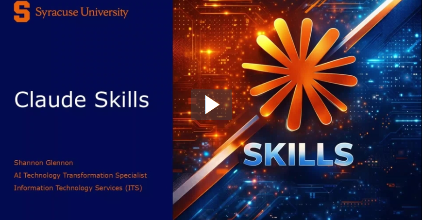

## Welcome to the AI at Syracuse University

Generative artificial intelligence (AI) tools like Claude by Anthropic, Microsoft Copilot and Google Gemini have redefined what it means to work, study, teach and create. These tools generate new content based on your prompts and if you bring it your data.

#### Stay up to date on the changing AI landscape with the ITS [AI Insights Newsletter](https://its.syr.edu/news-events/ai-insights/)

---

## Tools for Students, Faculty and Staff

🧠 **Claude Enterprise**

Claude Enterprise is an advanced AI assistant developed by Anthropic and is available to all Syracuse University students, faculty and staff.

[Learn more about Claude](./claude-enterprise-at-syracuse-university.md)

[Sign-up Now!](https://getclaude.syr.edu)

⭐ **Clementine Platform - mentorAI**

Syracuse Universitys private AI platform for Teaching  Learning and AI Innovation. Available to all Syracuse University students, faculty and staff.

[Learn more about the Clementine Platform](./mentorai-syracuse-university.md)

[Try Clementine](https://mentor.ai.syr.edu/platform/syracuse/e34f0313-81fc-4156-9cb1-aa7e0b90a3ce)

✨ **Microsoft Copilot**

A versatile assistant built with OpenAI's latest GPT-5 model (the same model that powers ChatGPT).

[Try Copilot](https://m365.cloud.microsoft/chat)

[FAQ](https://answers.atlassian.syr.edu/wiki/spaces/ITSAI/pages/488571112/Copilot+-+Frequently+Asked+Questions?atlOrigin=eyJpIjoiNTc2MzE0NTlmZjdjNGY1NmFmOTRjNmJmNzQ0MzhmMmYiLCJwIjoiYyJ9)

💎 **Google Gemini**

An AI assistant developed by Google, Syracuse has access Google's 2.5 Pro Model which features guided learning, image generation, and a canvas editor.

[Try Gemini](https://gemini.google.com/app)

[FAQ](https://answers.atlassian.syr.edu/wiki/spaces/ITSAI/pages/488865911/Gemini+-+Frequently+Asked+Questions?atlOrigin=eyJpIjoiMGVkMmM5NGMzMGI2NGI2NzgwOWYwZjI3NWZmZjQ5NWIiLCJwIjoiYyJ9)

### [Additional AI tools and platforms approved for use](./approved-tools-for-use-with-university-data.md)

---

### Ready to jump into AI, tired of reading?

Watch our Tech Tips video series on [Generative AI](https://video.syr.edu/playlist/details/1_spy966ue)

---

## Search this Knowledge Base

---

## Recently updated content
